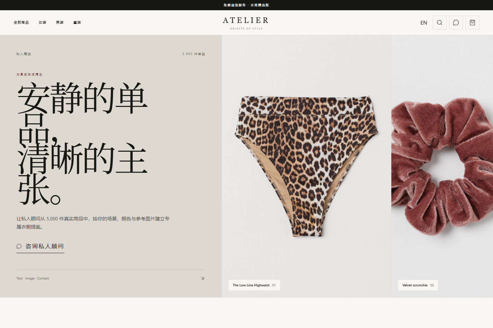
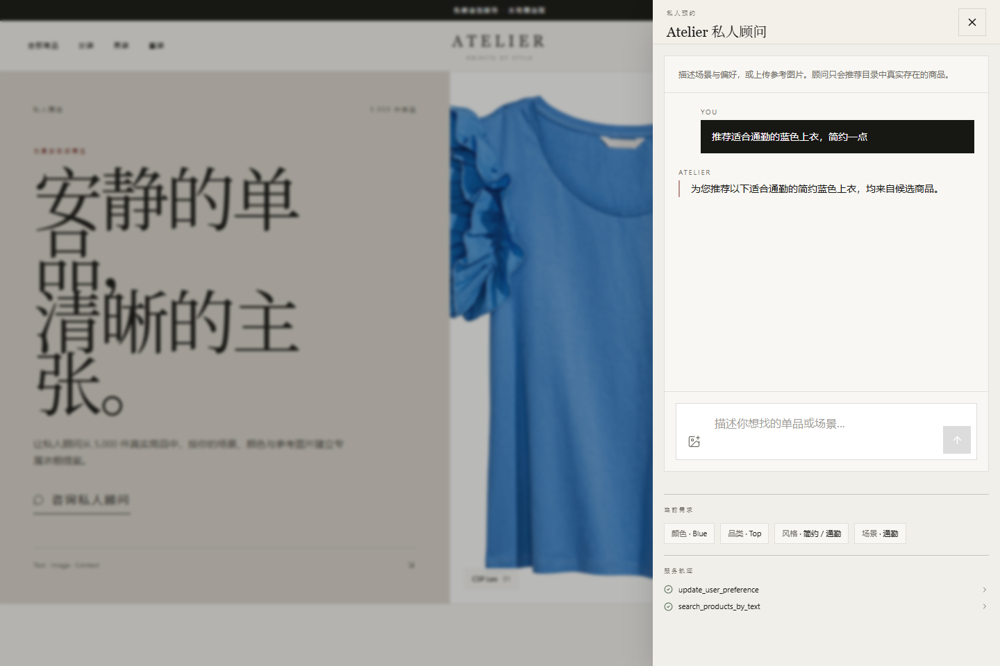
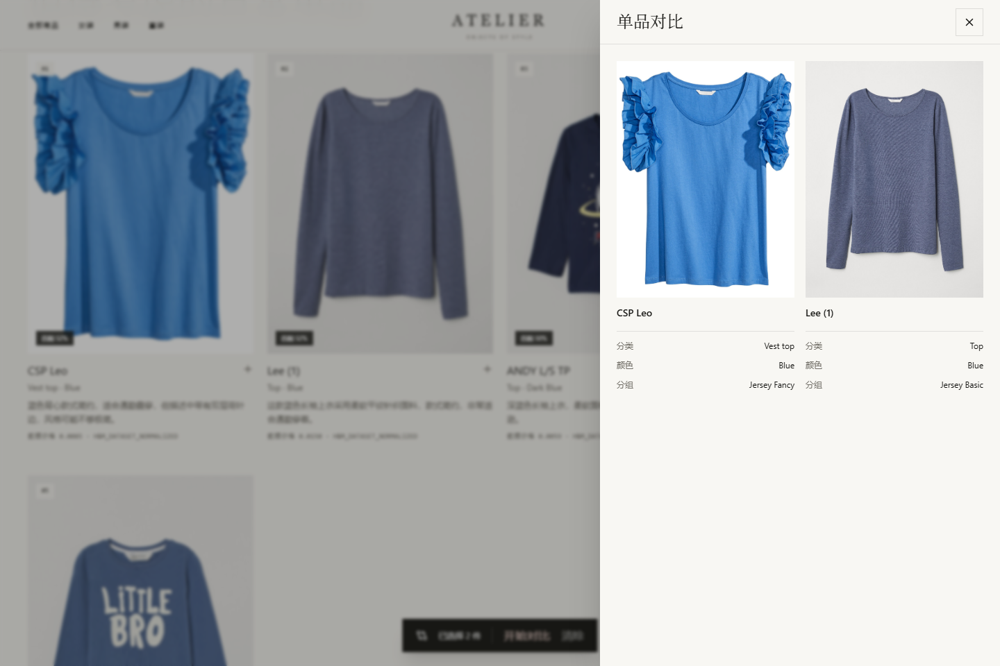
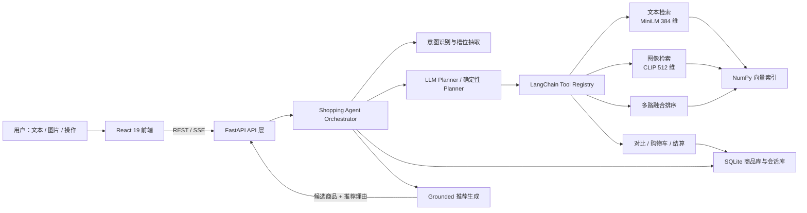
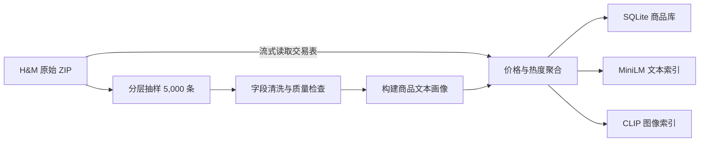

# Atelier：基于 RAG 的多模态电商智能导购 Agent

> 一个可本地运行、结果可追溯的 AI 服装导购系统。用户可以通过自然语言或参考图片找商品，Agent 会结合多轮偏好调用检索与交易工具，并基于真实商品目录完成推荐、对比、加购和模拟下单。



## 项目概览

传统电商搜索依赖关键词，难以理解“蓝色、简约、适合通勤”这类组合需求，也无法直接处理参考图片。Atelier 将商品文本、商品图片、结构化属性和交易热度统一到一条检索链路中，并通过 Agent 将“搜索—比较—加购—结算”串成连续对话。

项目基于 H&M Personalized Fashion Recommendations 公开数据集构建，当前本地样本包含 **5,000 个真实商品和 5,000 张商品图片**。系统不依赖 LLM 也能完成确定性检索和交易流程；接入 OpenAI-compatible API 后，LLM 负责工具选择与推荐文案生成，但不能绕过真实目录或凭空生成商品。

### 核心能力

- **多模态检索**：支持文本搜索、以图搜图，以及文本 + 图片 + 属性 + 热度的融合排序。
- **对话式导购**：识别颜色、品类、场景、风格、预算和排除项，跨轮次记住用户偏好。
- **Agent 工具调用**：统一封装检索、详情、对比、购物车、结算和偏好更新等 10 个工具。
- **结果可信**：推荐卡片只来自真实商品目录；LLM 返回的非法商品 ID 会被过滤。
- **完整交易闭环**：支持商品详情、2～3 件商品对比、持久购物车和模拟订单。
- **中英双语**：界面、偏好抽取、Agent 回复和语言偏好持久化均支持中文与英文。
- **离线可用**：模型和索引下载完成后可完全本地运行；LLM 不可用时自动进入确定性回退链路。

## 产品展示

### 1. 多轮智能导购

用户用自然语言描述场景和偏好，系统抽取结构化槽位，展示实际调用的工具，并流式返回基于真实候选集的推荐结果。



### 2. 商品对比

用户可以选择 2～3 件商品，从品类、颜色、商品组、价格等真实字段进行并列比较。



## 系统架构



### 一次推荐请求如何执行

1. 前端将文本、可选图片、会话 ID 和语言通过 `multipart/form-data` 发给后端。
2. API 校验图片类型、内容和 10 MB 大小上限，将 CPU 密集型推理放入工作线程。
3. 槽位抽取器从中英文请求中提取颜色、品类、风格、场景、预算和排除条件，并合并到会话偏好。
4. Planner 选择文本检索、图片检索、融合检索或交易工具；LLM 不可用时使用规则规划器。
5. Retriever 先执行结构化过滤，再计算向量相似度与融合分数，返回 Top-K 真实商品。
6. LLM 只能读取候选商品的安全字段并生成推荐理由；输出由 Pydantic 校验，越界商品 ID 被丢弃。
7. 后端通过 SSE 依次推送状态、意图、槽位、工具轨迹、商品和回复片段，前端增量渲染。

## 技术栈

| 层级 | 技术 | 在项目中的作用 |
| --- | --- | --- |
| 前端 | React 19、TypeScript 5.9 | 组件化 UI、严格类型约束、抽屉式交互 |
| 状态管理 | Zustand 5 | 管理商品、会话、偏好、消息、购物车和对比状态 |
| UI / 样式 | Tailwind CSS 4、Lucide React | 响应式页面、设计系统和图标 |
| 工程化 | Vite 6 | 本地开发、API 代理和生产构建 |
| 后端 | Python 3.12、FastAPI、Pydantic 2 | REST/SSE 接口、请求校验、结构化输出 |
| Agent | LangChain 1.3、langchain-openai | 工具注册、模型工具选择、Prompt 链和输出解析 |
| 文本向量 | `paraphrase-multilingual-MiniLM-L12-v2` | 生成 384 维中英文语义向量 |
| 图像向量 | `openai/clip-vit-base-patch32` | 生成 512 维商品图视觉向量 |
| 推理计算 | PyTorch、Transformers、Sentence Transformers | 本地模型加载与批量向量化 |
| 检索 | NumPy 归一化向量 + 余弦相似度 | 轻量本地向量索引与 Top-K 排序 |
| 数据存储 | SQLite、CSV、JSON | 商品目录、会话状态、购物车、评测集和报告 |
| 测试 | Pytest、Vitest、Playwright | 后端单元测试、前端单测和端到端流程测试 |
| 部署 | Docker、Docker Compose、Nginx | 前后端容器化、静态资源托管和 API 反向代理 |
| CI | GitHub Actions | 自动执行后端、前端、E2E 测试和生产构建 |

## 关键技术实现

### 1. 多模态 RAG 与融合排序

文本侧将商品名称、类型、颜色、图案、部门和描述拼成 `text_profile`，使用多语言 MiniLM 编码；图像侧使用 CLIP 编码商品主图。所有向量在写入索引前进行 L2 归一化，因此检索时可以直接用矩阵乘法计算余弦相似度。

融合检索不是简单拼接结果，而是在同一候选空间中进行加权排序：

```text
final_score = 0.30 × text_score
            + 0.45 × image_score
            + 0.15 × structured_score
            + 0.10 × popularity_score
```

- `text_score`：用户描述与商品文本的语义相似度。
- `image_score`：参考图片与商品图的视觉相似度。
- `structured_score`：颜色、品类等明确约束的匹配程度。
- `popularity_score`：由真实交易数据计算，并通过 `log1p` 降低头部商品的支配效应。

排序前先执行结构化硬过滤，避免“语义相似但违反用户明确条件”的商品进入结果。Top-K 使用 `argpartition` 缩小排序范围，避免对全部候选做完整排序。

### 2. 可控、可回退的 Agent

Agent 采用“编排器 + 工具注册表”的设计。Planner 只负责选择一个合法工具，具体参数校验、商品查询和状态变更仍由服务端完成。当前工具包括：

```text
search_products_by_text  search_products_by_image  hybrid_search
get_product_detail       compare_products          update_user_preference
add_to_cart              remove_from_cart          view_cart
checkout
```

这套设计解决了两个常见问题：

- **模型幻觉**：LLM 不直接生成商品卡片，只能为检索返回的白名单商品生成理由。
- **外部服务不稳定**：模型超时、输出解析失败或未配置 API Key 时，系统自动使用确定性意图识别和推荐文案，不阻断核心流程。

### 3. Grounded 推荐生成

进入 LLM 的商品数据只包含 `article_id`、名称、品类、颜色、描述和检索分数等安全字段。LLM 输出经过 Pydantic 模型约束，推荐理由最长 180 字，最多返回 3 件商品；服务端再次检查 `article_id` 是否属于候选集。若校验失败，则回退到基于目录字段生成的确定性理由。

### 4. 多轮会话与持久化

每个 `session_id` 对应以下状态：

- 最近对话历史；
- 颜色、品类、风格、场景、预算和排除项等偏好槽位；
- 最近一次检索结果，用于理解“第 1 件”“把刚才那件加购”等指代；
- 购物车商品。

内存缓存提升当前进程内的读取效率，SQLite 使用 UPSERT 持久化完整状态，并通过 `RLock` 保护同进程并发写入。服务重启后，会话和购物车仍可恢复。

### 5. SSE 流式响应

`POST /api/chat/stream` 将一次 Agent 执行拆成多类事件：

```text
status → meta → tool → products/comparison/cart/order → message → done
```

相比等待完整 JSON，前端可以先展示处理状态、偏好槽位和工具轨迹，再增量呈现回答，交互反馈更及时，也便于观察 Agent 的决策过程。

### 6. 数据真实性与边界处理

H&M 数据集中的交易 `price` 是归一化值，不等同于人民币或其他法币。项目在 `price_info` 中明确记录数值、单位和来源；数据集未提供真实尺码及实时库存时，接口返回 `available_sizes=[]` 和 `inventory_status=unknown`，前端展示“数据源未提供”，不伪造业务数据。

上传图片会经过 MIME 类型、文件大小和 Pillow 内容校验，临时文件在请求结束后删除。结算仅创建 `simulated` 本地订单，不涉及支付。

## 数据工程



原始压缩包不做全量解压，也不进入 Git。交易表采用流式读取，仅对抽样商品聚合价格与热度，降低磁盘和内存开销。向量索引记录模型名、维度、数据量和生成时间，启动时会校验索引与商品数据是否一致。

## 评测与工程质量

当前评测报告记录了 **62 条确定性用例**，覆盖文本自检索、意图识别和偏好槽位抽取：

| 指标 | 当前结果 |
| --- | ---: |
| 文本自检索用例 | 40 |
| Recall@1 / @5 / @10 | 1.000 / 1.000 / 1.000 |
| MRR@10 | 1.000 |
| 检索延迟 P50 | 40.66 ms |
| 检索延迟 P95 | 44.16 ms |
| 意图识别准确率 | 1.000 |
| 槽位抽取准确率 | 1.000 |

> 说明：以上是当前 5,000 商品样本上的回归/自检索指标，用于防止代码迭代导致能力退化，不代表线上泛化效果。更严格的生产评估还需要人工标注查询集、跨模态相关性标注、并发压测和 A/B 实验。

质量保障包含：

- Pytest：文本、图像、融合检索、Agent、偏好和持久化测试；
- Vitest：前端 API 客户端与 SSE 事件解析测试；
- Playwright：浏览、筛选、翻页、详情、对比、加购、结算、会话恢复、图片上传和双语切换；
- GitHub Actions：在每次 push / pull request 中执行全量测试和生产构建。

## 项目结构

```text
bytedance/
├─ backend/
│  ├─ app/
│  │  ├─ api/                 # 商品、检索、Agent、交易接口
│  │  ├─ core/
│  │  │  ├─ agent/           # Planner、Orchestrator、Memory、Tools
│  │  │  └─ retrieval/       # 文本、图像和融合检索
│  │  └─ db/                  # SQLite 连接
│  ├─ scripts/                # 数据处理、索引构建、评测脚本
│  ├─ tests/                  # 后端测试
│  ├─ evaluation/             # 固定评测集与报告
│  └─ data/                   # 本地样本、数据库和向量索引
├─ frontend/
│  ├─ src/
│  │  ├─ api/                 # REST / SSE 客户端
│  │  ├─ components/          # 商品、导购、对比、购物车组件
│  │  └─ store/               # Zustand 状态管理
│  └─ e2e/                    # Playwright 端到端测试
├─ docs/images/               # 项目展示截图
├─ .github/workflows/ci.yml   # 持续集成
└─ docker-compose.yml         # 本地容器编排
```

## 本地运行

### 环境要求

- Python 3.12
- Node.js 20
- Windows 10/11 或兼容的 Linux 环境
- 首次构建真实向量索引时需要访问 Hugging Face；模型缓存后可离线运行

### 1. 安装依赖

```powershell
python -m venv backend\.venv
backend\.venv\Scripts\Activate.ps1
python -m pip install -r backend\requirements.txt

cd frontend
npm ci
cd ..
```

### 2. 准备数据与索引

仓库未提交原始数据、图片、SQLite 和向量索引。下载 H&M 数据集后执行：

```powershell
python backend\scripts\sample_dataset.py `
  --zip_path <H&M数据集ZIP路径> `
  --out_dir backend\data\sample `
  --sample_size 5000

python backend\scripts\inspect_data.py
python backend\scripts\clean_articles.py
python backend\scripts\build_product_profiles.py
python backend\scripts\enrich_transactions.py --zip_path <H&M数据集ZIP路径>
python backend\scripts\build_sqlite.py

python backend\scripts\build_text_index.py `
  --input_csv backend\data\sample\product_profiles.csv `
  --index_dir backend\data\vector_store\text `
  --backend sentence-transformers --force

python backend\scripts\build_image_index.py `
  --input_csv backend\data\sample\product_profiles.csv `
  --index_dir backend\data\vector_store\image `
  --backend transformers-clip --device cpu --force
```

### 3. 启动服务

```powershell
# 终端 1：后端
python -m uvicorn app.main:app --app-dir backend --host 127.0.0.1 --port 18000

# 终端 2：前端
cd frontend
npm run dev
```

- 前端：<http://127.0.0.1:5173>
- API 文档：<http://127.0.0.1:18000/docs>
- 健康检查：<http://127.0.0.1:18000/health>

### 4. 可选 LLM 配置

系统支持 OpenAI-compatible API。未配置时仍可运行全部确定性检索与交易能力。

```powershell
$env:LLM_ENABLED="true"
$env:LLM_BASE_URL="https://api.example.com/v1"
$env:LLM_API_KEY="your-api-key"
$env:LLM_MODEL="your-model-name"
$env:LLM_THINKING="disabled"
```

### 5. Docker 启动

准备好 `backend/data` 后执行：

```powershell
docker compose up --build
```

## 测试

```powershell
python -m pytest backend\tests -q
python backend\scripts\evaluate_recommendations.py
python backend\scripts\validate_real_retrieval.py --device cpu

cd frontend
npm test
npm run test:e2e
npm run build
```

## 主要 API

| 方法 | 路径 | 说明 |
| --- | --- | --- |
| GET | `/health` | 检查商品库、文本索引和图像索引状态 |
| GET | `/api/products` | 商品分页、筛选、搜索和排序 |
| GET | `/api/products/{article_id}` | 商品详情 |
| POST | `/api/search/text` | 文本语义检索 |
| POST | `/api/search/image` | 以图搜图 |
| POST | `/api/search/hybrid` | 图文融合检索 |
| POST | `/api/chat` | 完整 Agent 响应 |
| POST | `/api/chat/stream` | SSE 流式 Agent 响应 |
| POST | `/api/compare` | 对比 2～3 件商品 |
| POST | `/api/cart/add` | 加入购物车 |
| POST | `/api/cart/remove` | 移出购物车 |
| POST | `/api/checkout` | 创建本地模拟订单 |

## 可继续演进

- 将 NumPy 全量向量计算替换为 FAISS / Milvus，并进行百万级商品压测；
- 引入人工标注的 query-product 相关性数据，评估 NDCG、跨模态 Recall 和推荐多样性；
- 增加 reranker，对召回结果进行更精细的语义重排；
- 将单进程锁与 SQLite 会话存储升级为 Redis + PostgreSQL；
- 增加鉴权、限流、链路追踪、模型成本监控和灰度发布能力。

